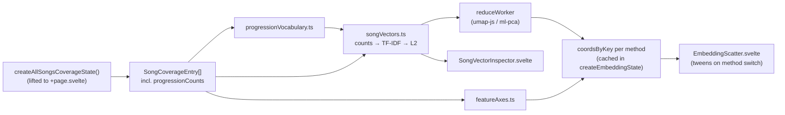

# harmony-map

A 2D scatter of every song in the corpus, positioned by **UMAP**, **PCA**, or hand-designed **feature axes**.

Route: `/demo/harmony-map/`

All three methods consume **one shared per-song vector**. The songs (points) never change when you switch method — only their coordinates — so switching animates each point from its old position to its new one instead of redrawing a different chart. Everything is built for explainability: click any point and the inspector shows the exact vector that produced its position.

## The one idea to hold onto

> Every song becomes a sparse vector over a vocabulary of chord progressions. Each method is just a different function from that vector to an `{x, y}`.

```
song → [matched progressions with counts] → sparse vector → {x, y}
```

Once you internalize that, the folder layout is obvious: `embedding/vectors/` builds the vector, `embedding/reducers/` turns vectors into coordinates, `embedding/state/` orchestrates and caches, `components/` draws.

## Data flow



## File layout

```
harmony-map/
  +page.svelte                   header + coverage wiring (stays thin)
  harmonyMapUrlState.ts          ?method read + replaceState sync
  methodDescriptions.ts          rationale / approach / tradeoffs copy (single source)
  progressionGroupColors.ts      group → color (d3 schemeTableau10) + legend items and copy

  views/
    EmbeddingView.svelte         method selector + weighting toggles + scatter + inspector

  embedding/
    vectors/                     pure, unit-tested, no Svelte — importable from workers + tests
      constants.ts               every threshold and weight lives here
      coreProgressionIdentity.ts sibling variants → one canonical key per named progression
      progressionVocabulary.ts   distinct progressions → ordered indices
      songVectors.ts             counts → TF-IDF → L2-normalized vectors
      nearestNeighbors.ts        cosine kNN
      featureAxes.ts             the interpretable bright/dark + simple/complex axes
      progressionGroups.ts       core-progression group profiles + dominant group per song
      index.ts                   barrel
      *.test.ts
    reducers/                    dimensionality reduction wrappers
      types.ts                   ReducerMethod / EmbeddingMethod / Coords (no worker import)
      pca.ts                     ml-pca + component loadings
      umap.ts                    umap-js, seeded, cosine distance
      reduceWorker.ts            worker entry
      index.ts                   reduceOffMainThread() + re-exports
    state/
      createEmbeddingState.svelte.ts   builds vectors, runs reductions, caches by method

  components/
    EmbeddingScatter.svelte      canvas 2D + d3-zoom, animated position tween
    SongVectorInspector.svelte   per-song vector explainability panel
    SongTooltip.svelte           song hover card
    hoverCardPosition.ts         tooltip placement math
    scatterPoint.ts              ScatterPoint type (separate file — Svelte can't export types)
```

**Rule of thumb when adding code:** anything numerical and testable goes in `embedding/vectors/` or `embedding/reducers/` as a plain `.ts` module. Svelte files should only wire things together and draw.

## 1. Where the data comes from

The embedding needs _all_ matched progressions per song, not just the core ones. That comes from the existing coverage worker, which was extended for this feature:

`define-chord-progression/compute-coverage-of-all-songs/worker.ts`

```ts
export type SongProgressionCount = {
	chordProgression: string; // e.g. "I-V-vi-IV"
	scale: ScaleName; // "major" | "minor" | …
	matchCount: number; // occurrences within this song
	isCore: boolean; // from coreSelected vs gapSelected
};

export type SongCoverageEntry = {
	// …
	matchingProgressions: string[]; // core-only, UNCHANGED
	progressionCounts: SongProgressionCount[]; // NEW — core + gap
};
```

`progressionCounts` is `[...selection.coreSelected, ...selection.gapSelected]`. The older `matchingProgressions` was deliberately left alone so the beeswarm and every other consumer keep working exactly as before. **If you need more per-progression signal in the embedding, add a field here** — it's already computed inside `selectFinalProgressions`, it just isn't forwarded.

Coverage is built once in `+page.svelte` via `createAllSongsCoverageState()` and passed down. That state also owns the shared "recent songs only" corpus filter.

## 2. Building the vectors — `embedding/vectors/`

| File | Job |
| --- | --- |
| `coreProgressionIdentity.ts` | Collapse sibling variants (`I-V-vi-IV` / `i-v-VI-III` / …) onto one canonical key via `allProgressionGroups`. Gap progressions pass through unchanged. |
| `progressionVocabulary.ts` | Distinct progressions → ordered indices. Core-first, then gaps alphabetically. |
| `songVectors.ts` | Counts → optional TF-IDF → L2-normalized sparse vectors. Options: `weighting: "tfidf" \| "raw"`, `l2Normalize: boolean`. |
| `nearestNeighbors.ts` | Cosine kNN over the vector set (used by the inspector and the scatter highlight). |
| `featureAxes.ts` | Hand-designed `{brightness, complexity}` axes. Brightness blends scale / qualities / degrees with the core group's brightness; complexity blends distinct-count, breadth and extended-chord share. |
| `progressionGroups.ts` | Dominant core group per song (for scatter color). |
| `constants.ts` | Every threshold and weight. |

## 3. Reducing to 2D — `embedding/reducers/`

| File | Job |
| --- | --- |
| `types.ts` | `EmbeddingMethod`, `Coords`, `ReductionResult`, `ComponentLoading`. **No worker import** — safe to import from URL state and descriptions. |
| `pca.ts` | `ml-pca` + component loadings + explained variance. |
| `umap.ts` | `umap-js`, seeded, cosine distance. |
| `reduceWorker.ts` | Worker entry that dispatches UMAP / PCA. |
| `index.ts` | `reduceOffMainThread()` + re-exports. |

⚠️ **Import `reducers/types.js` directly, not `reducers/index.js`, from anything that shouldn't pull in the worker.** `index.ts` imports `./reduceWorker.ts?worker`; `types.ts` is dependency-free. That's why `harmonyMapUrlState.ts` and `methodDescriptions.ts` import from `types.js`.

## 4. Orchestration — `createEmbeddingState.svelte.ts`

Builds vocabulary + vectors, runs reductions (or feature axes synchronously), caches results by `datasetToken|method`, and exposes `{ method, status, result, setMethod, setOptions }`.

The caching trick worth understanding before you edit this file:

```ts
const dataset = $derived.by(() => ({
	token: `dataset-${++datasetSequence}`, // new token whenever songs or options change
	vectorSet: buildSongVectors(songs, vocabulary, options)
}));

const cacheKey = $derived(`${dataset.token}|${method}`);
```

Results are cached under `datasetToken|method`. Switching method is then instant (and therefore animatable) on the second visit, while changing the corpus filters or the weighting toggles mints a fresh token and prunes stale entries. The compute `$effect` early-returns when `resultCache.has(key)` — it writes the cache and re-runs once, then settles. **Don't make `status` a dependency of that effect** or you'll create a loop.

## 5. Rendering

### `EmbeddingScatter.svelte`

Canvas 2D (not SVG — thousands of points) with `d3-zoom` attached to the canvas for pan/zoom.

The key design decision: **coordinates are normalized to a unit square before tweening.** Each incoming coordinate set is min/max-normalized to `[0, 1]`, and the tween runs in that normalized space. Axis rescaling between methods therefore falls out for free — PCA's `-0.4 … 0.9` range and UMAP's `-8 … 12` range both become `[0, 1]`, and points travel a sane distance.

Other things to know:

- Points are keyed by `songKey`; `displayedPositions` is a **non-reactive** `Map` mutated by the rAF loop, and the loop calls `draw()` itself. Making it `$state` would thrash the reactive graph 60 times a second.
- The tween effect wraps its body in `untrack()`. Without it, `draw()`'s reads of `transform`/`selectedSongKey` would make the tween restart on every zoom or click.
- A deterministic per-song jitter (`JITTER_AMPLITUDE`) separates songs with identical vectors — very common, since many songs match only `I-V-vi-IV` — so they stay individually hoverable.
- Hover picking is a linear scan over points within `HOVER_PICK_RADIUS`. Fine at this corpus size; reach for a quadtree only if it actually gets slow.
- Selecting a song dims everything except it and its cosine neighbors.
- Dot color is the song's **dominant core group** (`dominantGroupName`): each matched core progression adds its occurrence count to its group, highest total wins, grey when a song matches no core progression. The legend states this, with the full rule in a hover tooltip — both strings live in `progressionGroupColors.ts`.

### `SongVectorInspector.svelte`

The explainability panel: search box, then for the selected song its nonzero dimensions (progression, core/gap badge, raw count, IDF, weight, contribution bar), its coordinates and dominant group, its top-8 cosine neighbors, and — when PCA is active — the top progression loadings per component.

Core dimensions also show their progression name and, when the name has multiple variants, a "merged with …" note so the collapsed variants aren't invisible.

### `SongTooltip.svelte`

The song hover card wraps `FinalAnnotatedSong` and recomputes `selectFinalProgressions` for the hovered song. Placement math lives in `hoverCardPosition.ts`.

## 6. URL state

`harmonyMapUrlState.ts` syncs `?method=umap|pca|feature` via `replaceState`. The default (`umap`) is omitted from the URL.

## 7. Descriptions

`methodDescriptions.ts` is the single source for `{ title, summary, rationale, approach, tradeoffs }` per embedding method, shown as a hover tooltip on each method radio button. **If you change how a method works, update its copy here** — it's the only user-facing explanation of the tradeoffs.

## Adding a new embedding method

1. Add it to `EmbeddingMethod` / `EMBEDDING_METHODS` in `embedding/reducers/types.ts`.
2. If it needs a reducer, add `embedding/reducers/yourMethod.ts` returning `ReductionResult`, and dispatch to it in `reduceWorker.ts`. If it's cheap and derived from song data instead of vectors, follow `featureAxes.ts` and handle it synchronously in `createEmbeddingState`.
3. Add copy to `embeddingMethodLabels` + `embeddingMethodDescriptions` in `methodDescriptions.ts` (both are exhaustive `Record`s, so TypeScript will tell you).
4. Add axis labels (or `null`) to `AXIS_LABELS_BY_METHOD` in `views/EmbeddingView.svelte`.

The selector, URL sync, caching and animation need no changes.

## Testing + checks

```bash
npx vitest run src/routes/demo/harmony-map   # 21 tests over vocab / vectors / feature axes
npm run check                                # svelte-check — keep this at 0 errors, 0 warnings
npx prettier --write "src/routes/demo/harmony-map/**/*.{ts,svelte}"
```

Tests cover the pure modules only — that's the point of keeping them Svelte-free. New numerical logic should land in `embedding/vectors/` with a test beside it.

Note: `npm run build` currently fails while prerendering `/demo/core-progressions/` (`createAllSongsCoverageState` reads `url.searchParams` during prerender). **That failure pre-dates this feature** and is unrelated — bundling, including the reduce worker chunk, completes before it.

## Gotchas

- **Don't touch `matchingProgressions`.** It is core-only and load-bearing for the beeswarm and match-rate stats. Add to `progressionCounts` instead.
- **No magic numbers.** Every threshold and weight belongs in `embedding/vectors/constants.ts` (or the constant block at the top of the component).
- The corpus is filtered by the shared "recent songs only" toggle in the header. Changing it rebuilds coverage _and_ invalidates the embedding cache — expect a recompute.
- Vectors and the matrix are plain `number[][]`, structured-cloned to the worker. That's deliberate for readability; if the full corpus ever feels sluggish, typed arrays + transferables are the first optimization, not a different algorithm.
