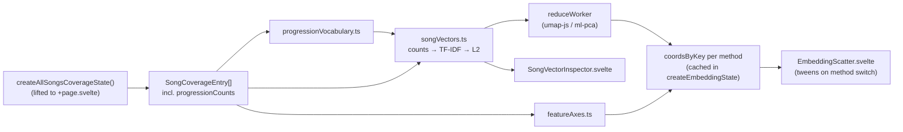

# harmony-map

Two ways to lay out the same song corpus, as tabs on one page:

1. **Force graph** — the original bipartite song ↔ progression network, laid out by physical simulation (`@cosmograph/cosmos`).
2. **Embedding map** — a 2D scatter of every song, positioned by **UMAP**, **PCA**, or hand-designed **feature axes**.

Route: `/demo/harmony-map/`

The point of the second tab is that all three methods consume **one shared per-song vector**. The songs (points) never change when you switch method — only their coordinates — so switching animates each point from its old position to its new one instead of redrawing a different chart. Everything is built for explainability: click any point and the inspector shows the exact vector that produced its position.

## The one idea to hold onto

> Every song becomes a sparse vector over a vocabulary of chord progressions. Each method is just a different function from that vector to an `{x, y}`.

```
song → [matched progressions with counts] → sparse vector → {x, y}
```

Once you internalize that, the folder layout is obvious: `embedding/vectors/` builds the vector, `embedding/reducers/` turns vectors into coordinates, `embedding/state/` orchestrates and caches, `components/` draws.

## Data flow



## File layout

```
harmony-map/
  +page.svelte                   header + tab bar + tab router only (stays thin)
  harmonyMapUrlState.ts          ?view / ?method read + replaceState sync
  progressionGroupColors.ts      group → color (d3 schemeTableau10) + legend items and copy

  tabs/
    tabDescriptions.ts           rationale / approach / tradeoffs copy (single source)
    TabBar.svelte                two-tab switcher
    TabInfoPanel.svelte          collapsible info panel (wraps CollapsiblePanel)

  views/
    ForceGraphView.svelte        builds the network + renders ForceGraph
    EmbeddingView.svelte         method selector + weighting toggles + scatter + inspector

  graph/
    ForceGraph.svelte            cosmos WebGL force graph (moved here from the route root)

  embedding/
    vectors/                     pure, unit-tested, no Svelte — importable from workers + tests
      constants.ts               every threshold and weight lives here
      coreProgressionIdentity.ts sibling variants → one canonical key per named progression
      progressionVocabulary.ts   distinct progressions → ordered indices
      songVectors.ts             counts → TF-IDF → L2-normalized vectors
      nearestNeighbors.ts        cosine kNN
      featureAxes.ts             the interpretable bright/dark + simple/complex axes
      progressionGroups.ts       core-progression group profiles + dominant group per song
      index.ts                   barrel
      *.test.ts
    reducers/                    dimensionality reduction wrappers
      types.ts                   ReducerMethod / EmbeddingMethod / Coords (no worker import)
      pca.ts                     ml-pca + component loadings
      umap.ts                    umap-js, seeded, cosine distance
      reduceWorker.ts            worker entry
      index.ts                   reduceOffMainThread() + re-exports
    state/
      createEmbeddingState.svelte.ts   builds vectors, runs reductions, caches by method

  components/
    EmbeddingScatter.svelte      canvas 2D + d3-zoom, animated position tween
    SongVectorInspector.svelte   per-song vector explainability panel
    SongTooltip.svelte           shared song hover card (used by graph + scatter)
    hoverCardPosition.ts         shared tooltip placement math
    scatterPoint.ts              ScatterPoint type (separate file — Svelte can't export types)
```

**Rule of thumb when adding code:** anything numerical and testable goes in `embedding/vectors/` or `embedding/reducers/` as a plain `.ts` module. Svelte files should only wire things together and draw.

## 1. Where the data comes from

The embedding needs _all_ matched progressions per song, not just the core ones. That comes from the existing coverage worker, which was extended for this feature:

`define-chord-progression/compute-coverage-of-all-songs/worker.ts`

```ts
export type SongProgressionCount = {
	chordProgression: string; // e.g. "I-V-vi-IV"
	scale: ScaleName; // "major" | "minor" | …
	matchCount: number; // occurrences within this song
	isCore: boolean; // from coreSelected vs gapSelected
};

export type SongCoverageEntry = {
	// …existing fields…
	matchingProgressions: string[]; // core-only, UNCHANGED
	progressionCounts: SongProgressionCount[]; // core + gap, added for this feature
};
```

`progressionCounts` is `[...selection.coreSelected, ...selection.gapSelected]`. The older `matchingProgressions` was deliberately left alone so the force graph, beeswarm and every other consumer keep working exactly as before. **If you need more per-progression signal in the embedding, add a field here** — it's already computed inside `selectFinalProgressions`, it just isn't forwarded.

The coverage state (`createAllSongsCoverageState()`) is instantiated **once in `+page.svelte`** and shared by both tabs, so switching tabs doesn't recompute coverage.

## 2. Vectorization (`embedding/vectors/`)

### Vocabulary

`buildProgressionVocabulary(songs, minGapDocumentFrequency)` collects every distinct `chordProgression` and assigns it an index.

- **Core progressions are always kept**, however rare.
- **Gap-fill progressions need `documentFrequency >= MIN_GAP_DOCUMENT_FREQUENCY`** (default `4`, in `constants.ts`). Gap progressions are arbitrary chord windows discovered per song, so without this gate the dimension count explodes with one-offs.
- Document frequency counts **songs**, not occurrences.
- Entries are sorted core-first then by frequency, so index 0 is the most common core progression. Handy when reading loadings.

### Variants share one dimension

A named core progression in `$data/core-progressions.ts` can list several variants (`"jazz ii-V-I"` is `["ii7-V7-Imaj7", "ii-V-I"]`). **All of a name's variants collapse into a single dimension**, keyed by the first authored variant — `coreProgressionIdentity.ts` owns that mapping. Concretely:

- `indexByChordProgression` contains an entry for _every_ variant pointing at the shared index, so callers can look up by whichever variant the matcher selected.
- `occurrencesByIndex` in `songVectors.ts` sums them: a song matching `ii7-V7-Imaj7` ×3 and `ii-V-I` ×2 contributes 5 to that one dimension.
- Document frequency counts such a song **once**, and `weighting: "binary"` yields 1, not 2.

Without this, one musical idea splits across two axes: two songs playing "the same" progression in different voicings look less similar than they are, and each half looks artificially rare to IDF.

The canonical key is the first authored variant rather than the most-matched one, so the vocabulary stays stable as the corpus changes. Gap-fill progressions have no name or variants, so each distinct one remains its own dimension. `featureAxes.ts` deliberately keeps reading the **raw** variant strings, since variants genuinely differ in length, harmonic breadth and extensions — exactly the signals those axes measure.

### Song vectors

`buildSongVectors(songs, vocabulary, options)` → `{ vectors, vectorBySongKey, inverseDocumentFrequencies, options }`.

Each `SongVector` keeps both representations, which is what makes the inspector possible:

- `counts` — raw match counts (or 1s when `weighting: "binary"`), for display.
- `weighted` — what actually gets embedded: counts × IDF, then L2-normalized.

IDF is smoothed sklearn-style, `log((N + 1) / (df + 1)) + 1`, so it never goes negative.

Defaults (`DEFAULT_SONG_VECTOR_OPTIONS`): raw counts, TF-IDF **on**, L2 **on**. This is the right default for sparse progression data — L2 + dot product is cosine similarity, and TF-IDF stops "I-V-vi-IV" (which half the corpus matches) from dominating every axis. All three are toggleable in the UI for experimentation.

### Feature axes

`computeFeatureAxes(song)` returns `{ x, y }` in `[-1, 1]`, derived only from existing data:

- **x — bright ↔ dark.** Per progression: `scale === "minor"`, the share of minor/diminished chord qualities, and the share of flattened degrees, weighted by the constants in `constants.ts`. For **core** progressions this is blended with the brightness of the group it belongs to (`CORE_GROUP_DARKNESS_BLEND`), because chord qualities alone under-read a progression like `i-VII-VI-V` as bright. Per-song value is the match-count-weighted average.
- **y — simple ↔ complex.** Distinct progression count, harmonic breadth (distinct scale degrees per progression), and the share of extended chords (any suffix outside `BASE_CHORD_SUFFIXES`).

Roman tokens are parsed with the shared `parseRomanToken` from `chord-processing/romanNumerals.ts` — **don't hand-roll roman numeral parsing here.**

Group brightness is derived programmatically from `$data/core-progressions.ts` (share of a group's progressions in a major scale), not hardcoded, so adding a progression to a group automatically shifts that group's brightness.

## 3. Reducers (`embedding/reducers/`)

|               | `pca.ts`                                | `umap.ts`                       |
| ------------- | --------------------------------------- | ------------------------------- |
| library       | `ml-pca`                                | `umap-js`                       |
| deterministic | yes                                     | yes (seeded PRNG)               |
| distance      | linear / covariance                     | cosine (`1 - cosineSimilarity`) |
| extra output  | component loadings + explained variance | none                            |

Both return the shared `ReductionResult` shape and both no-op (returning `EMPTY_REDUCTION_RESULT`) when there are too few rows or zero dimensions.

`umap-js` doesn't re-export its `cosine` from the package root, so `umap.ts` reuses our own `cosineSimilarity` from `vectors/nearestNeighbors.ts`.

Reductions run in `reduceWorker.ts` (loaded via Vite's `?worker` suffix, same as the coverage worker). Feature axes are cheap and run synchronously on the main thread.

⚠️ **Import `reducers/types.js` directly, not `reducers/index.js`, from anything that shouldn't pull in the worker.** `index.ts` imports `./reduceWorker.ts?worker`; `types.ts` is dependency-free. That's why `harmonyMapUrlState.ts` and `tabDescriptions.ts` import from `types.js`.

## 4. State + caching (`embedding/state/createEmbeddingState.svelte.ts`)

Owns `method`, `options`, the result cache and `status`. Exposes `{ method, options, status, vocabulary, vectorSet, result, setMethod, setOptions }`.

The caching trick worth understanding before you edit this file:

```ts
const dataset = $derived.by(() => ({
	token: `dataset-${++datasetSequence}`, // new token whenever songs or options change
	vectorSet: buildSongVectors(songs, vocabulary, options)
}));

const cacheKey = $derived(`${dataset.token}|${method}`);
```

Results are cached under `datasetToken|method`. Switching method is then instant (and therefore animatable) on the second visit, while changing the corpus filters or the weighting toggles mints a fresh token and prunes stale entries. The compute `$effect` early-returns when `resultCache.has(key)` — it writes the cache and re-runs once, then settles. **Don't make `status` a dependency of that effect** or you'll create a loop.

The state is created in `+page.svelte`, so embeddings warm up even while the Force graph tab is showing.

## 5. Rendering

### `EmbeddingScatter.svelte`

Canvas 2D (not SVG — thousands of points) with `d3-zoom` attached to the canvas for pan/zoom.

The key design decision: **coordinates are normalized to a unit square before tweening.** Each incoming coordinate set is min/max-normalized to `[0, 1]`, and the tween runs in that normalized space. Axis rescaling between methods therefore falls out for free — PCA's `-0.4 … 0.9` range and UMAP's `-8 … 12` range both become `[0, 1]`, and points travel a sane distance.

Other things to know:

- Points are keyed by `songKey`; `displayedPositions` is a **non-reactive** `Map` mutated by the rAF loop, and the loop calls `draw()` itself. Making it `$state` would thrash the reactive graph 60 times a second.
- The tween effect wraps its body in `untrack()`. Without it, `draw()`'s reads of `transform`/`selectedSongKey` would make the tween restart on every zoom or click.
- A deterministic per-song jitter (`JITTER_AMPLITUDE`) separates songs with identical vectors — very common, since many songs match only `I-V-vi-IV` — so they stay individually hoverable.
- Hover picking is a linear scan over points within `HOVER_PICK_RADIUS`. Fine at this corpus size; reach for a quadtree only if it actually gets slow.
- Selecting a song dims everything except it and its cosine neighbors.
- Dot color is the song's **dominant core group** (`dominantGroupName`): each matched core progression adds its occurrence count to its group, highest total wins, grey when a song matches no core progression. The legend states this, with the full rule in a hover tooltip — both strings live in `progressionGroupColors.ts`.

### `SongVectorInspector.svelte`

The explainability panel: search box, then for the selected song its nonzero dimensions (progression, core/gap badge, raw count, IDF, weight, contribution bar), its coordinates and dominant group, its top-8 cosine neighbors, and — when PCA is active — the top progression loadings per component.

Core dimensions also show their progression name and, when the name has multiple variants, a "merged with …" note so the collapsed variants aren't invisible.

### `SongTooltip.svelte`

The song hover card, extracted from `ForceGraph.svelte` so the graph and the scatter render an identical card. It wraps `FinalAnnotatedSong` and recomputes `selectFinalProgressions` for the hovered song. Placement math for both hosts lives in `hoverCardPosition.ts`.

## 6. URL state

`harmonyMapUrlState.ts` syncs `?view=graph|embedding` and `?method=umap|pca|feature` via `replaceState`, following the same pattern as `songCorpusFilterUrlParams.ts`. Defaults (`graph`, `umap`) are omitted from the URL. The corpus filter param (`recent`) is preserved because writes copy the existing `searchParams`.

## 7. Descriptions

`tabs/tabDescriptions.ts` is the single source for `{ title, summary, rationale, approach, tradeoffs }` per view and per embedding method, rendered by `TabInfoPanel.svelte`. **If you change how a method works, update its copy here** — it's the only user-facing explanation of the tradeoffs.

## Adding a new embedding method

1. Add it to `EmbeddingMethod` / `EMBEDDING_METHODS` in `embedding/reducers/types.ts`.
2. If it needs a reducer, add `embedding/reducers/yourMethod.ts` returning `ReductionResult`, and dispatch to it in `reduceWorker.ts`. If it's cheap and derived from song data instead of vectors, follow `featureAxes.ts` and handle it synchronously in `createEmbeddingState`.
3. Add copy to `embeddingMethodLabels` + `embeddingMethodDescriptions` in `tabs/tabDescriptions.ts` (both are exhaustive `Record`s, so TypeScript will tell you).
4. Add axis labels (or `null`) to `AXIS_LABELS_BY_METHOD` in `views/EmbeddingView.svelte`.

The selector, URL sync, caching and animation need no changes.

## Testing + checks

```bash
npx vitest run src/routes/demo/harmony-map   # 21 tests over vocab / vectors / feature axes
npm run check                                # svelte-check — keep this at 0 errors, 0 warnings
npx prettier --write "src/routes/demo/harmony-map/**/*.{ts,svelte}"
```

Tests cover the pure modules only — that's the point of keeping them Svelte-free. New numerical logic should land in `embedding/vectors/` with a test beside it.

Note: `npm run build` currently fails while prerendering `/demo/core-progressions/` (`createAllSongsCoverageState` reads `url.searchParams` during prerender). **That failure pre-dates this feature** and is unrelated — bundling, including the reduce worker chunk, completes before it.

## Gotchas

- **Don't touch `matchingProgressions`.** It is core-only and load-bearing for the force graph, beeswarm and match-rate stats. Add to `progressionCounts` instead.
- **No magic numbers.** Every threshold and weight belongs in `embedding/vectors/constants.ts` (or the constant block at the top of the component).
- The corpus is filtered by the shared "recent songs only" toggle in the header. Changing it rebuilds coverage _and_ invalidates the embedding cache — expect a recompute.
- Vectors and the matrix are plain `number[][]`, structured-cloned to the worker. That's deliberate for readability; if the full corpus ever feels sluggish, typed arrays + transferables are the first optimization, not a different algorithm.
